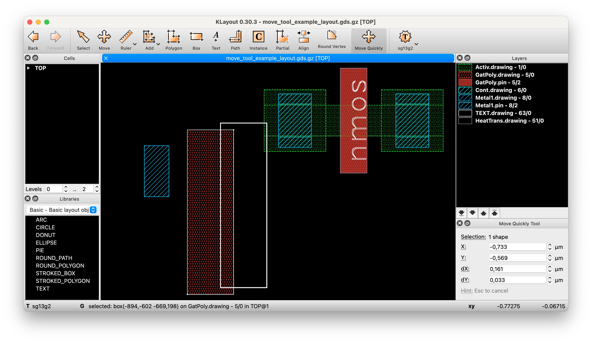
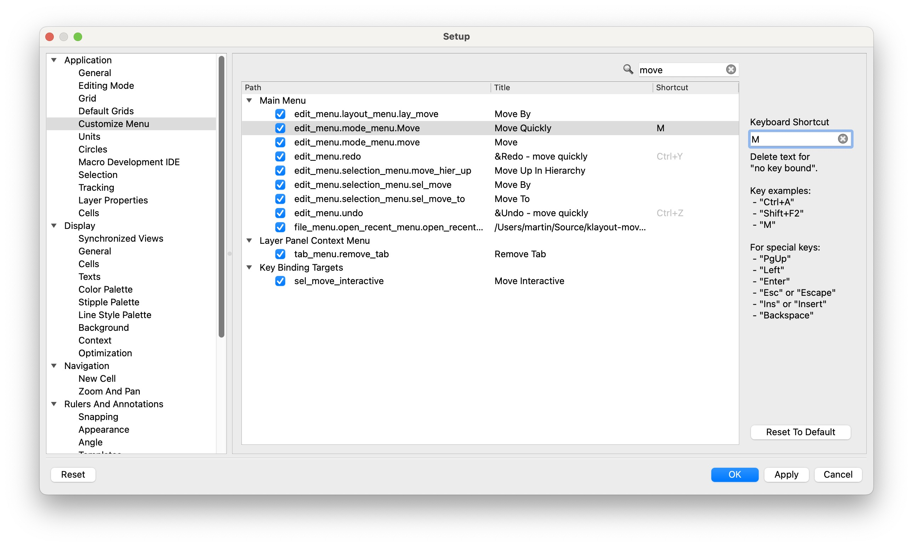
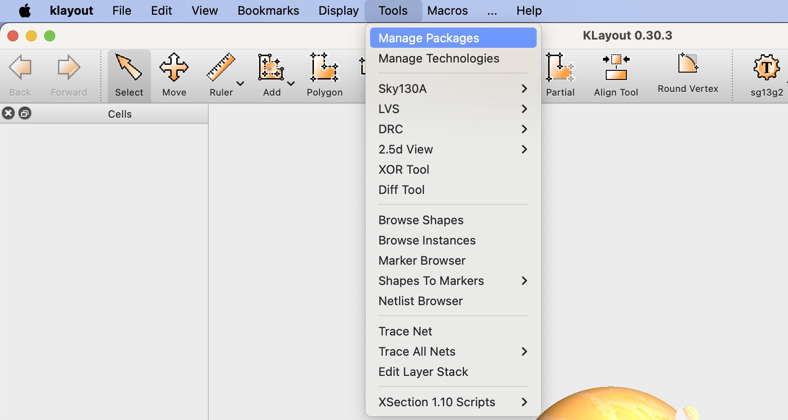
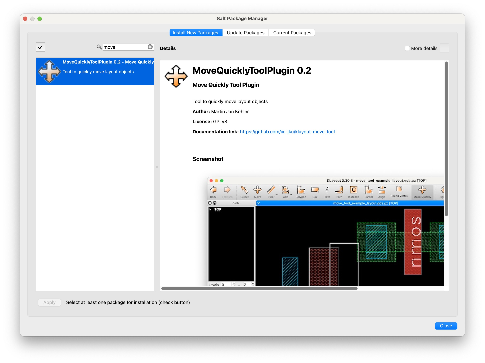
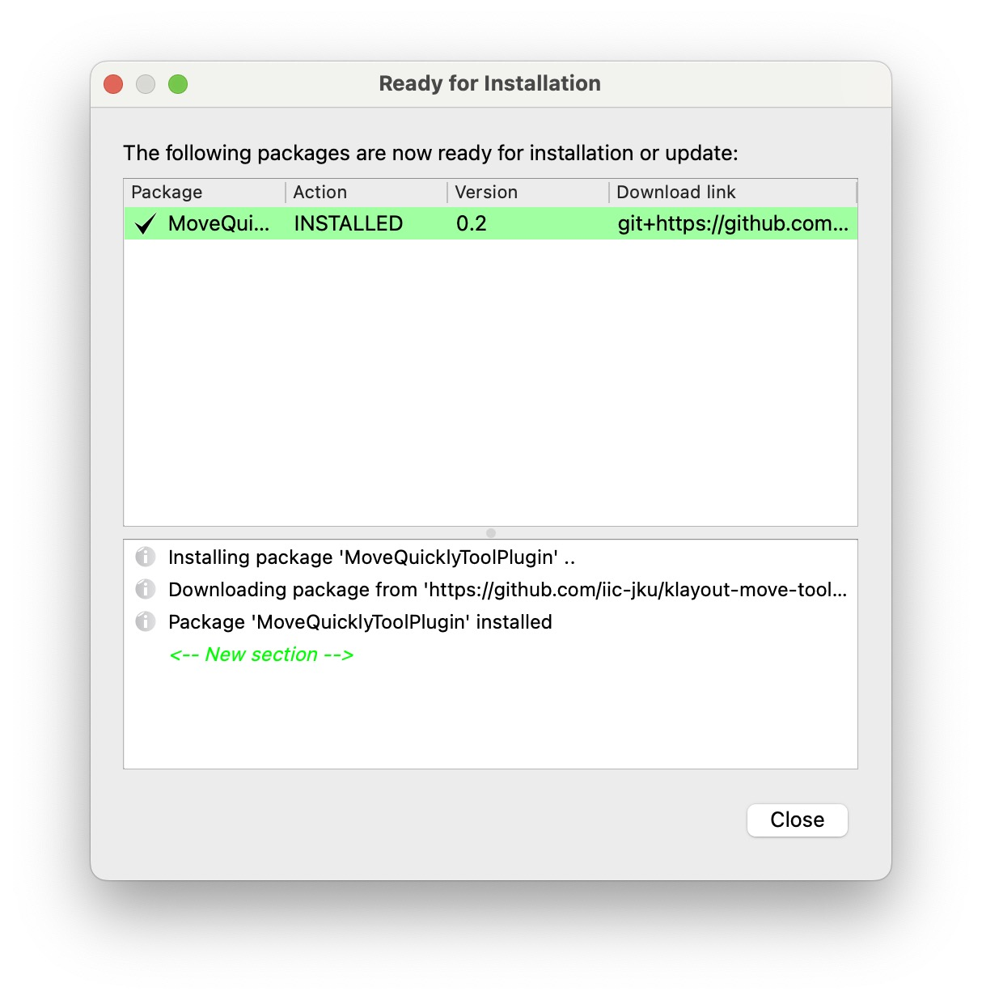
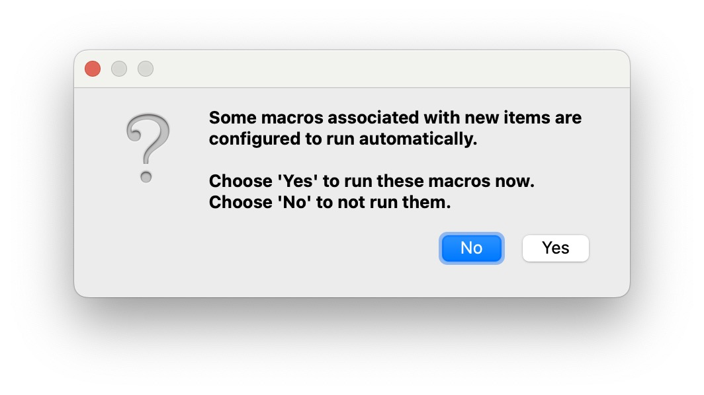

# KLayout Plugin: Move Quickly Tool

<!--

-->

* Boost your layout productivity with quick moves of layout elements, such as
   * cell instances
   * shapes (e.g. polygons, boxes, paths)

This add-on can be installed through [KLayout](https://klayout.de) package manager, [see installation instructions here](#installation-instructions)

After installation, this tool can be accessed through *Toolbar*→*Move quickly*

## Usage

### Pre-selection

- You can select instances and shapes (you want to move), before invoking the tool
   - The selection will be displayed in the dock setup panel

### Tool activation and deactivation

- Click the *Move Quickly* tool or press `M` to enter the tool mode (if you've configured the key binding [as explained here](#shortcut)
- Press `Esc` at any time to abort the tool and activate the regular KLayout selection tool.

### Example 1: Moving single object (mouse)

- Activate the tool
- If there is no selection, left-click an object to move it
- Otherwise, left-click again to move it
- Move the mouse to the destination
- Click to move the object

### Example 2: Moving single object (keyboard)

- Activate the tool
- Left-click an object to select it
- Press `Tab` to enter the dock setup widget
- Provide either absolute positions or relativ deltas
- Press `Enter` to commit the move operation

### Example 3: Extend selection
- Activate the tool
- Select an object
- Hold `Shift` and select additional object(s)
- Click to start moving
- Move the mouse to the desired destination
- Commit the move operation with a click or by pressing `Enter`

### Example 4: Drag selection
- Activate the tool
- Select object(s) by dragging the mouse
- Hold `Shift` and select additional object(s)
- Click to start moving
- Move the mouse to the desired destination
- Commit the move operation with a click or by pressing `Enter`

 
## Pro-Tip: assign key binding `M` to the tool

- In the main menu, open the Preferences/Settings in KLayout
- Navigate to *Application*→*Customize Menu*
- Search for 'Move'
- Assign the shortcut `M` to the path `edit_menu.mode_menu.Move_quickly`

## Installation using KLayout Package Manager

1. From the main menu, click *Tools*→*Manage Packages* to open the package manager

2. Locate the `MoveQuicklyToolPlugin`, double-click it to select for installation, then click *Apply*

3. Review and close the package installation report

4. Confirm macro execution

